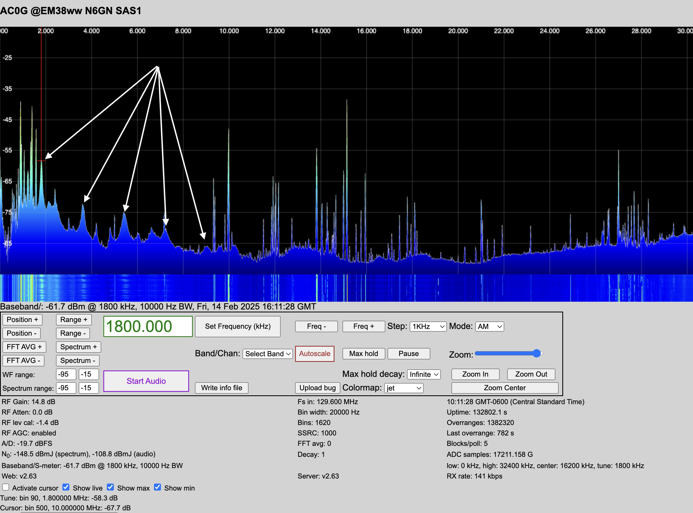

# Case Study 4: Repeating Spectral Humps at 1.8MHz Intervals

## Symptom:
- Wavy noise peaks appear every 1.8 MHz, gradually decreasing in amplitude up to 9 MHz.

- The pattern also appears on another antenna/receive system at the same site.

<video width="640" height="480" controls>
  <source src="../_images/multiples_1.8MHz.mov" type="video/quicktime">
  Your browser does not support the video tag.
</video>

## Analysis:
- This pattern suggests harmonics of a switching power supply.
- Many cheap wall warts, LED drivers, and computer chargers generate harmonic noise.

## Mitigation Steps:
1.	Identify the Device:
- Unplug switching power supplies one at a time and observe changes in the waterfall.
2.	Replace or Shield:
- If a device is the culprit, swap it for a linear power supply.
- If replacement isn’t possible, add ferrite chokes (Mix 43 for VHF, Mix 31 for HF) to the DC output.
3.	Filter the Power Line:
- Use an AC line filter to block conducted emissions.
