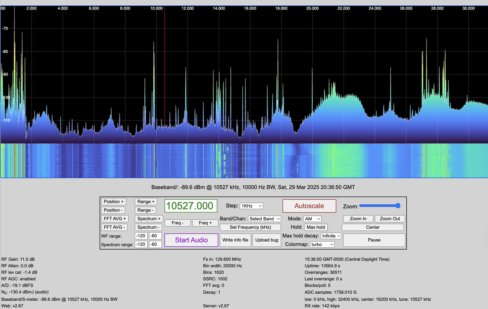
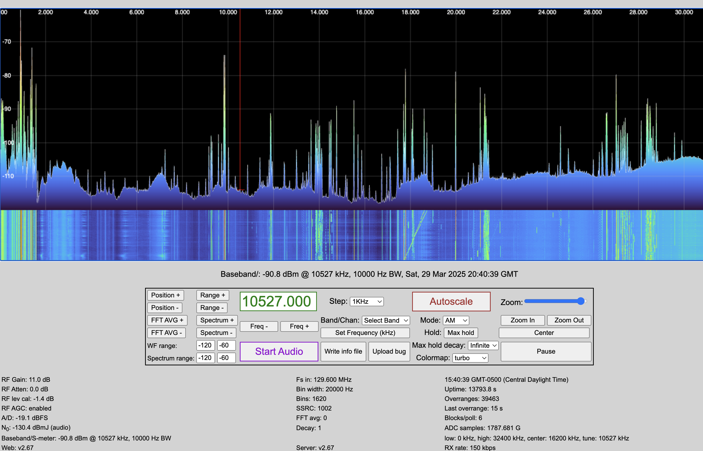

# Case Study 1: Noise Heaps

## Symptom:
- Spectrum display shows spikey heaps of noise at various frequencies.
- The noise is broadband.

## Analysis:
- Suggests:
- Possible sources: 

## Mitigation Steps:
1.	Test Isolation: Insert a common-mode choke (ferrite on coax, Mix 31 for HF) near the antenna and near the receiver.
2.	Check Grounding: Ensure the feedline shield is grounded at a single point.
3.	Re-route the Cable: Keep coax away from noise sources (AC lines, routers, computers).
4.	Improve Shielding: Use higher-quality coax like LMR-400 or clamp ferrites on both ends.

A battery charger in reconditioning mode:

The same charger in charging mode:
