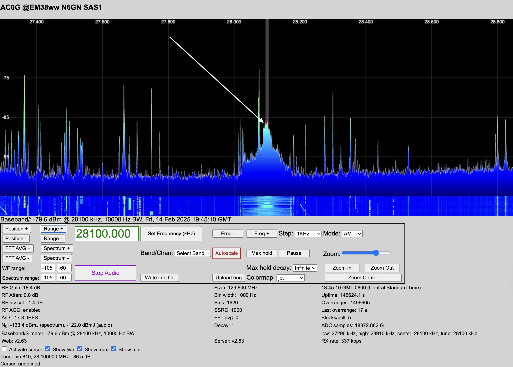

# General Identification & Mitigation Strategies

A structured approach to guide case studies.

## Identifying RF Noise

### Visual Clues (Waterfall Display / Spectrum Analysis)
- Broadband noise: A raised noise floor across a wide frequency range.
- Narrowband noise: Persistent or drifting carriers at specific frequencies.
- Harmonic patterns: Repeating peaks at regular frequency intervals.
- Time-variable noise: Noise that changes when equipment cycles on/off.

Note the huge, broad signal at 28.1 MHz, spreading across the 10m band.  Subtracting that from the RX888's 129.6 MHz sampling frequency leaves 101.5 MHz, the broadcast frequency of local FM station, KPLA.  

- 28.1 MHz <-- 101.5 FM
- 32.9 MHz <--  96.7 FM
- 37.5 MHz <--  93.9 FM
- 38.3 MHz <--  91.3 FM
- 40.1 MHz <--  89.5 FM
- 40.7 MHz <--  88.9 FM

### Audible Clues (AM/SSB/CW Listening)
- Buzzing/Humming: Power line noise, poor grounding, or switching power supplies.
- Popping/Clicking: Arcing from bad insulators, motors, or thermostats.
- Whining or Warbling: Switching regulators, LED dimmers, and microprocessor clocks.
- Rushing/Frying Sounds: Plasma TVs, grow lights, electric fences.

### Physical & Electrical Proximity Clues
- Changes when moving a cable? Suspect common-mode currents or shielding issues.
- Noise disappears on battery power? The source is on the AC mains.
- Directional changes? Use a loop or Yagi to pinpoint sources.
- Not affected by power cycling? Could be an external source like power lines.

## Mitigation Strategies

### Shielding & Enclosures
- Use metal cases, ferrites, and shielded cables for noisy devices.

### Filtering
- Use common-mode chokes, AC line filters, and capacitor bypassing.

### Grounding & Bonding
- Ensure proper single-point grounding to avoid ground loops.

### Antenna & Feedline Management
- Use current chokes, baluns, and reposition antennas away from interference.

## A layered approach:
1.	Detect the noise (waterfall, audio, directionality).
2.	Measure its characteristics (harmonics, patterns, conducted vs. radiated).
3.	Localize the source (power down, portable radio, ferrites).
4.	Mitigate using filtering, shielding, grounding, and better equipment.

